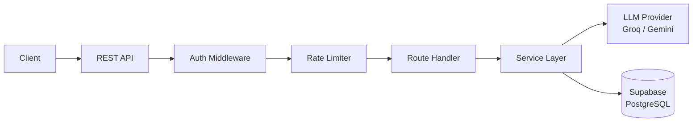

# Conversation API

A production-grade REST API for managing AI-powered conversations with streaming support, built with FastAPI and Supabase.

## Architecture



## Features

- **Authentication**: JWT access/refresh tokens + API key support
- **Conversation CRUD**: Create, list, get, update, delete with ownership enforcement
- **Real-time streaming**: Token-by-token SSE delivery matching Anthropic's event spec
- **Multi-provider LLM**: Groq (primary) with Google AI (Gemini) fallback
- **Context management**: Sliding window with token budget to fit model limits
- **Rate limiting**: Per-user sliding window (60 req/min standard, 10 req/min AI)
- **Cost tracking**: Per-request cost estimation and usage statistics
- **Auto-title**: LLM-generated conversation titles on first message
- **Thinking mode**: Optional step-by-step reasoning in responses
- **Security**: CORS, security headers, bcrypt passwords, no exposed internals

## Setup

### Prerequisites

- Python 3.11+
- A Supabase project (free tier works)
- Groq API key ([console.groq.com](https://console.groq.com))
- (Optional) Google AI API key for fallback

### Installation

```bash
git clone https://github.com/your-user/conversation-api.git
cd conversation-api
python -m venv .venv
source .venv/bin/activate
pip install -r requirements.txt
```

### Database

Run the schema in your Supabase SQL editor:

```bash
# Copy database/schema.sql content into Supabase SQL Editor and execute
```

### Configuration

Copy `.env.example` to `.env` and fill in your values:

```bash
cp .env.example .env
```

### Run

```bash
uvicorn src.main:app --reload
```

API docs available at `http://localhost:8000/docs`

## Environment Variables

| Variable | Description | Required |
|----------|-------------|----------|
| `SUPABASE_URL` | Supabase project URL | Yes |
| `SUPABASE_ANON_KEY` | Supabase anonymous key | Yes |
| `SUPABASE_SERVICE_ROLE_KEY` | Supabase service role key | Yes |
| `DATABASE_URL` | Direct PostgreSQL connection string | Yes |
| `JWT_SECRET` | Secret for signing JWTs (min 32 chars) | Yes |
| `JWT_ACCESS_TOKEN_EXPIRE_MINUTES` | Access token lifetime | No (default: 30) |
| `JWT_REFRESH_TOKEN_EXPIRE_DAYS` | Refresh token lifetime | No (default: 7) |
| `GROQ_API_KEY` | Groq API key | Yes |
| `GOOGLE_AI_API_KEY` | Google AI API key (fallback) | No |
| `ALLOWED_ORIGINS` | Comma-separated CORS origins | No |
| `DEFAULT_MODEL` | Primary LLM model ID | No (default: llama-3.1-8b-instant) |
| `FALLBACK_MODEL` | Fallback model ID | No (default: gemini-1.5-flash) |
| `RATE_LIMIT_STANDARD` | Requests per minute (standard) | No (default: 60) |
| `RATE_LIMIT_AI` | Requests per minute (AI generation) | No (default: 10) |

## API Endpoints

| Method | Endpoint | Description |
|--------|----------|-------------|
| `GET` | `/health` | Health check |
| `POST` | `/api/v1/auth/register` | Register new user |
| `POST` | `/api/v1/auth/login` | Login, get tokens |
| `POST` | `/api/v1/auth/refresh` | Refresh access token |
| `POST` | `/api/v1/auth/logout` | Revoke refresh token |
| `POST` | `/api/v1/conversations` | Create conversation |
| `GET` | `/api/v1/conversations` | List conversations |
| `GET` | `/api/v1/conversations/:id` | Get conversation + messages |
| `PATCH` | `/api/v1/conversations/:id` | Update conversation |
| `DELETE` | `/api/v1/conversations/:id` | Delete conversation |
| `GET` | `/api/v1/conversations/:id/messages` | List messages |
| `POST` | `/api/v1/conversations/:id/messages` | Send message (non-streaming) |
| `POST` | `/api/v1/conversations/:id/messages/stream` | Send message (SSE streaming) |
| `GET` | `/api/v1/conversations/:id/events` | Real-time conversation events |
| `GET` | `/api/v1/usage/stats` | Usage statistics |
| `GET` | `/api/v1/models` | List supported models |

## Example Usage

### Register & Login

```bash
# Register
curl -X POST http://localhost:8000/api/v1/auth/register \
  -H "Content-Type: application/json" \
  -d '{"email":"user@example.com","password":"SecurePass123"}'

# Login
curl -X POST http://localhost:8000/api/v1/auth/login \
  -H "Content-Type: application/json" \
  -d '{"email":"user@example.com","password":"SecurePass123"}'
```

### Create Conversation & Send Message

```bash
# Create conversation
curl -X POST http://localhost:8000/api/v1/conversations \
  -H "Authorization: Bearer $TOKEN" \
  -H "Content-Type: application/json" \
  -d '{"title":"My Chat","model":"llama-3.1-8b-instant"}'

# Send message (non-streaming)
curl -X POST http://localhost:8000/api/v1/conversations/$CONV_ID/messages \
  -H "Authorization: Bearer $TOKEN" \
  -H "Content-Type: application/json" \
  -d '{"content":"What is the capital of France?"}'
```

### Streaming

```bash
curl -N -X POST http://localhost:8000/api/v1/conversations/$CONV_ID/messages/stream \
  -H "Authorization: Bearer $TOKEN" \
  -H "Content-Type: application/json" \
  -d '{"content":"Tell me about quantum computing"}'
```

### Thinking Mode

```bash
curl -X POST http://localhost:8000/api/v1/conversations/$CONV_ID/messages \
  -H "Authorization: Bearer $TOKEN" \
  -H "Content-Type: application/json" \
  -d '{"content":"What is 847 * 293?","thinking":true}'
```

## Testing

```bash
pytest tests/ -v
```

## Swagger Docs

Once running, interactive API documentation is available at:
- Swagger UI: `http://localhost:8000/docs`
- ReDoc: `http://localhost:8000/redoc`

## Project Structure

```
src/
├── main.py              # FastAPI app entry point
├── auth/                # JWT, middleware, auth routes
├── config/              # Settings, CORS
├── conversations/       # CRUD: schemas, repository, service, routes
├── db/                  # Supabase client, model constants
├── llm/                 # LLM clients, token counter, context, prompts
├── messages/            # Message routes, service, SSE streaming
├── middleware/           # Rate limiter, request ID, error handler
├── usage/               # Usage stats, models listing
└── utils/               # Cost tracker, validators
```
